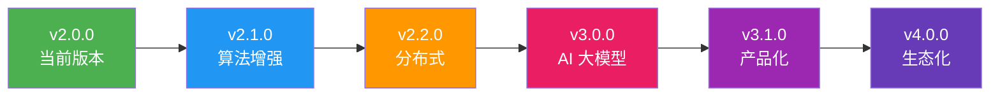

# AI视觉质检系统 - 发展路线图

## 📋 版本历史

### v2.0.0 (2026-03-24) - 功能增强完整版 ✅

**新增功能**：
- ✅ 数据持久化与数据库集成
- ✅ 用户认证与权限管理
- ✅ SMTP 邮件通知
- ✅ WebSocket 消息队列优化
- ✅ PWA 支持
- ✅ 错误监控和上报
- ✅ Docker 容器化部署
- ✅ CI/CD自动化流程

**技术升级**：
- Python 3.8 → 3.9
- Node.js 16 → 18
- 多阶段 Docker 构建
- Nginx 反向代理优化

---

## 🎯 v2.1.0 规划（2026 Q2）

### 缺陷检测算法增强

**目标**：提升检测精度和速度

**功能点**：
- [ ] 支持 YOLOv8 最新版本
- [ ] 集成 YOLOv9 实验性支持
- [ ] 多模型融合推理
- [ ] 小目标检测优化
- [ ] 缺陷分类细化

**技术指标**：
- mAP 提升至 95%+
- 推理速度 < 30ms/帧
- 支持分辨率 4K 输入

### 3D 视觉支持

**功能点**：
- [ ] 深度相机集成（RealSense、Kinect）
- [ ] 3D 点云数据处理
- [ ] 高度差检测
- [ ] 平面度检测
- [ ] 体积测量

**应用场景**：
- PCB 焊点检测
- 零件尺寸测量
- 表面平整度检测

### 智能标注工具

**功能点**：
- [ ] 半自动标注（AI 辅助）
- [ ] 批量标注
- [ ] 标注质量管理
- [ ] 在线标注界面
- [ ] 标注版本控制

**预期效果**：
- 标注效率提升 50%
- 标注准确率 98%+

---

## 🚀 v2.2.0 规划（2026 Q3）

### 分布式部署

**架构升级**：

```
┌──────────────┐
│  Load Balancer│
└──────┬───────┘
       │
   ┌───▼───┐
   │ Edge 1│──▶ 摄像头组 1
   └───┬───┘
       │
   ┌───▼───┐
   │ Edge 2│──▶ 摄像头组 2
   └───┬───┘
       │
   ┌───▼───┐
   │ Edge N│──▶ 摄像头组 N
   └───┬───┘
       │
   ┌───▼─────────┐
   │ Central Server│
   │ - 数据分析    │
   │ - 模型训练    │
   │ - 统一管控    │
   └──────────────┘
```

**功能点**：
- [ ] 边缘节点管理
- [ ] 负载均衡
- [ ] 数据同步
- [ ] 集中式监控
- [ ] 联邦学习支持

**技术栈**：
- Kubernetes 编排
- Redis Cluster
- Kafka 消息队列
- MinIO 对象存储

### 模型自学习

**功能点**：
- [ ] 在线增量学习
- [ ] 主动学习（Active Learning）
- [ ] 难例挖掘
- [ ] 模型自适应调整
- [ ] A/B 测试框架

**工作流程**：
```
检测 → 低置信度样本 → 人工复核 → 加入训练集 → 模型更新 → 部署验证
```

### 高级分析功能

**功能点**：
- [ ] 缺陷趋势预测
- [ ] 质量关联分析
- [ ] 根本原因分析（RCA）
- [ ] SPC 统计过程控制
- [ ] CPK 过程能力分析

**报表增强**：
- [ ] 自定义报表模板
- [ ] 定时自动生成
- [ ] 多维度对比分析
- [ ] 移动端报表查看

---

## 💡 v3.0.0 愿景（2026 Q4）

### AI 大模型集成

**探索方向**：
- [ ] Vision Transformer (ViT) 应用
- [ ] Segment Anything Model (SAM) 集成
- [ ] 多模态大模型（CLIP 等）
- [ ] 零样本缺陷检测
- [ ] 少样本学习

**预期优势**：
- 减少标注数据依赖
- 提升泛化能力
- 支持新缺陷类型快速适配

### 数字孪生

**功能构想**：
- [ ] 产线虚拟映射
- [ ] 实时状态仿真
- [ ] 预测性维护
- [ ] 工艺参数优化
- [ ] 远程专家系统

### 边缘计算优化

**目标**：
- [ ] Jetson Orin 原生支持
- [ ] TensorRT 深度优化
- [ ] 模型量化（INT8）
- [ ] 功耗优化（< 30W）
- [ ] 离线运行能力

### 行业解决方案

**重点行业**：
1. **锂电制造**
   - 极片缺陷检测
   - 电芯外观检测
   - Pack 组装检测

2. **半导体**
   - 晶圆缺陷检测
   - 封装外观检测
   - 引脚共面性

3. **汽车零部件**
   - 压铸件检测
   - 注塑件检测
   - 装配完整性

4. **医药包装**
   - 标签检测
   - 瓶盖密封性
   - 包装盒完整性

---

## 🔧 技术债务清理计划

### 代码质量提升

**待办事项**：
- [ ] 单元测试覆盖率提升至 90%
- [ ] 代码复杂度降低（Cyclomatic Complexity < 10）
- [ ] 消除所有 Code Smell
- [ ] 完善类型注解（Type Hints）
- [ ] 统一代码风格（Black + Ruff）

### 文档完善

**计划**：
- [ ] API 文档自动化生成
- [ ] 视频教程系列
- [ ] 最佳实践指南
- [ ] 故障排查知识库
- [ ] 多语言文档（中英双语）

### 性能优化

**目标**：
- [ ] 启动时间 < 10s
- [ ] 内存占用 < 500MB
- [ ] CPU 使用率 < 30%（空闲时）
- [ ] 网络延迟 < 5ms（局域网）

---

## 🌟 长期愿景（2027+）

### 产品化方向

**SaaS 服务**：
- [ ] 多租户架构
- [ ] 云端模型训练
- [ ] 按需付费模式
- [ ] 白标解决方案

**硬件一体机**：
- [ ] 预装软件的设备
- [ ] 即插即用
- [ ] 远程运维
- [ ] 硬件看门狗

### 生态建设

**开源社区**：
- [ ] 建立贡献者体系
- [ ] 定期技术分享
- [ ] 举办黑客松
- [ ] 提供奖学金

**合作伙伴**：
- [ ] 相机厂商合作
- [ ] 集成商培训认证
- [ ] 高校联合实验室
- [ ] 行业协会参与

### 国际化

**目标市场**：
- [ ] 东南亚制造业
- [ ] 欧洲工业 4.0
- [ ] 北美智能制造

**本地化**：
- [ ] 多语言界面
- [ ] 本地技术支持
- [ ] 符合当地标准（CE, UL 等）

---

## 📊 技术发展路线



---

## 🎓 人才培养计划

### 内部培训

**课程体系**：
- [ ] AI视觉基础理论
- [ ] 深度学习实战
- [ ] 工程化最佳实践
- [ ] 产品思维培养
- [ ] 项目管理方法

### 外部合作

**形式**：
- [ ] 高校实习基地
- [ ] 联合培养研究生
- [ ] 企业导师制度
- [ ] 技术竞赛赞助

---

## 🏆 关键成功指标（KPI）

### 技术指标

| 指标 | 当前值 | 目标值 | 时间节点 |
|------|--------|--------|----------|
| 检测精度 (mAP) | 92% | 98% | 2026 Q4 |
| 推理速度 | 50ms | 20ms | 2026 Q3 |
| 系统可用性 | 99% | 99.9% | 2026 Q4 |
| 客户满意度 | 4.5/5 | 4.8/5 | 持续 |
| Bug 解决时效 | 48h | 24h | 2026 Q2 |

### 业务指标

| 指标 | 当前值 | 目标值 | 时间节点 |
|------|--------|--------|----------|
| 部署案例数 | 10+ | 100+ | 2027 Q1 |
| 行业覆盖 | 2 | 10 | 2027 Q1 |
| 合作伙伴 | 3 | 20 | 2027 Q1 |
| 社区 Star 数 | 500+ | 5000+ | 2027 Q1 |
| 月活跃用户 | 100+ | 1000+ | 2027 Q1 |

---

## 💰 投入产出预估

### 研发投入

| 项目 | 人力 | 时间 | 预算 |
|------|------|------|------|
| v2.1.0 | 3 人 | 3 个月 | 50 万 |
| v2.2.0 | 5 人 | 6 个月 | 120 万 |
| v3.0.0 | 8 人 | 12 个月 | 300 万 |

### 预期收益

| 来源 | 年度收入 | 利润率 |
|------|----------|--------|
| 软件授权 | 500 万 | 80% |
| 技术服务 | 200 万 | 60% |
| 定制开发 | 300 万 | 50% |
| 培训课程 | 50 万 | 90% |
| **合计** | **1050 万** | **~70%** |

---

## ⚠️ 风险评估

### 技术风险

1. **AI 算法瓶颈**
   - 风险：检测精度无法进一步提升
   - 对策：引入新技术路线（Transformer 等）

2. **人才流失**
   - 风险：核心技术人员离职
   - 对策：股权激励、职业发展通道

3. **技术迭代**
   - 风险：新技术快速出现
   - 对策：保持技术敏感度，快速跟进

### 市场风险

1. **竞争加剧**
   - 风险：大厂进入细分市场
   - 对策：深耕垂直领域，建立壁垒

2. **需求变化**
   - 风险：客户需求快速变化
   - 对策：敏捷开发，快速响应

---

## 📝 行动项清单

### 近期（1 个月内）

- [ ] 完成 v2.1.0 需求评审
- [ ] 组建算法优化小组
- [ ] 启动第一批用户调研
- [ ] 建立技术文档 Wiki
- [ ] 制定代码审查流程

### 中期（3 个月内）

- [ ] 发布 v2.1.0 版本
- [ ] 申请 2 项技术专利
- [ ] 签约 3 家试点客户
- [ ] 举办首次技术沙龙
- [ ] 启动 A 轮融资准备

### 长期（6 个月内）

- [ ] 用户数突破 1000
- [ ] 通过 ISO9001 认证
- [ ] 建立海外办事处
- [ ] 举办首届用户大会
- [ ] 启动 IPO 规划

---

**编制时间**: 2026-03-24  
**版本**: v1.0  
**审批**: 技术委员会  
**下次更新**: 2026-06-01
